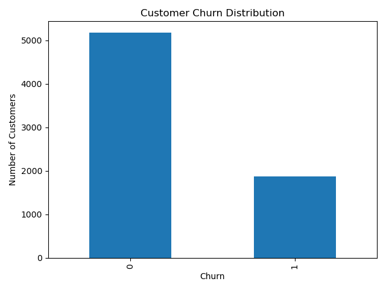
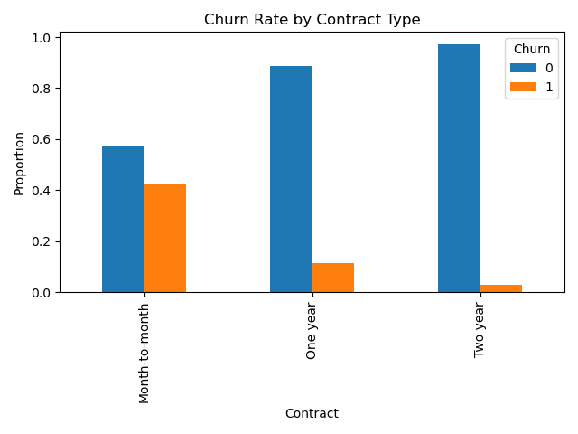
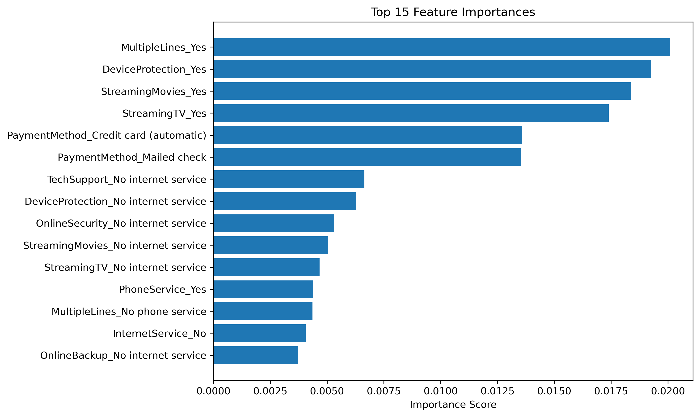

# Customer Churn Analytics: Predicting Customer Attrition and Identifying Retention Opportunities

## Overview

Customer churn is one of the most significant challenges facing subscription-based businesses. Retaining existing customers is often far more cost-effective than acquiring new ones, making churn prediction a critical business problem.

This project analyzes customer behavior using the IBM Telco Customer Churn dataset to identify the drivers of customer attrition, develop predictive models, and generate actionable business recommendations aimed at improving retention and protecting recurring revenue.

The project combines exploratory data analysis, machine learning, and business-focused decision making to simulate a real-world analytics engagement.

---

## Business Problem

A telecommunications company wants to answer four key questions:

- Which customers are most likely to churn?
- What factors drive customer churn?
- Which customer segments should be prioritized for retention efforts?
- How much revenue is potentially at risk?

---

## Dataset

**Source:** IBM Telco Customer Churn Dataset

**Records:** 7,043 customers

**Features Include:**
- Customer demographics
- Service subscriptions
- Contract information
- Billing information
- Customer tenure
- Churn outcome

---

## Visual Insights

### Customer Churn Distribution

The dataset contains both retained and churned customers, providing a realistic classification problem.



### Churn Rate by Contract Type

Contract type emerged as one of the strongest predictors of customer retention. Month-to-month customers exhibited substantially higher churn rates than customers on annual contracts.



### Feature Importance

The Random Forest model identified contract structure, customer tenure, and billing-related variables as the most influential predictors of churn.



---

## Project Workflow

### 1. Data Preparation

- Data quality validation
- Missing value handling
- Feature engineering
- Categorical variable encoding
- Model-ready dataset creation

### 2. Exploratory Data Analysis

Key findings included:

- Month-to-month customers are significantly more likely to churn
- Customers with lower tenure have elevated churn risk
- Higher monthly charges are associated with increased churn
- Behavioral and contractual variables are stronger predictors than demographic characteristics

### 3. Predictive Modeling

Models evaluated:

- Logistic Regression
- Random Forest Classifier

Evaluation metrics:

- Accuracy
- Precision
- Recall
- F1 Score

### 4. Business Impact Analysis

Model outputs were translated into business recommendations focused on:

- Customer retention
- Revenue protection
- Customer segmentation
- Targeted intervention strategies

---

## Key Findings

### Contract Structure Is the Primary Driver of Churn

Customers enrolled in month-to-month contracts demonstrate significantly higher churn rates than customers on one-year or two-year agreements.

### The First Year Is Critical

Customer tenure consistently emerged as one of the strongest predictors of churn. New customers represent the highest-risk segment.

### High-Value Customers Require Proactive Retention

Customers with higher monthly charges exhibit increased churn risk, highlighting the importance of monitoring high-revenue accounts.

### Churn Is Predictable

The analysis demonstrates that churn is not random. High-risk customer groups can be identified and targeted before attrition occurs.

---

## Business Recommendations

### Prioritize Month-to-Month Customers

Develop targeted campaigns that encourage migration to longer-term contracts.

### Strengthen Customer Onboarding

Invest in engagement and support programs during the first year of the customer lifecycle.

### Monitor High-Charge Accounts

Implement proactive retention strategies for customers generating significant recurring revenue.

### Deploy Predictive Risk Scoring

Use model outputs to identify high-risk customers and focus retention resources where they are most likely to produce ROI.

---

## Repository Structure

```text
customer-churn-analytics/
│
├── assets/
│   ├── churn_distribution.png
│   ├── churn_by_contract.png
│   ├── feature_importance.csv
│   └── feature_importance.png
│
├── data/
│   └── raw/
│
├── notebooks/
│   ├── 01_churn_analysis_and_modeling.ipynb
│   └── 02_business_recommendations.ipynb
│
├── dashboard/
│
├── README.md
└── .gitignore
```

---

## Technologies Used

- Python
- Pandas
- NumPy
- Scikit-Learn
- Matplotlib
- Jupyter Notebook
- Git
- GitHub

---

## Future Improvements

- XGBoost implementation
- Hyperparameter tuning
- SHAP explainability analysis
- Interactive Power BI dashboard
- Automated customer risk scoring system

---

## Author

Developed as an end-to-end business analytics and machine learning project demonstrating data cleaning, exploratory analysis, predictive modeling, and business decision support.
